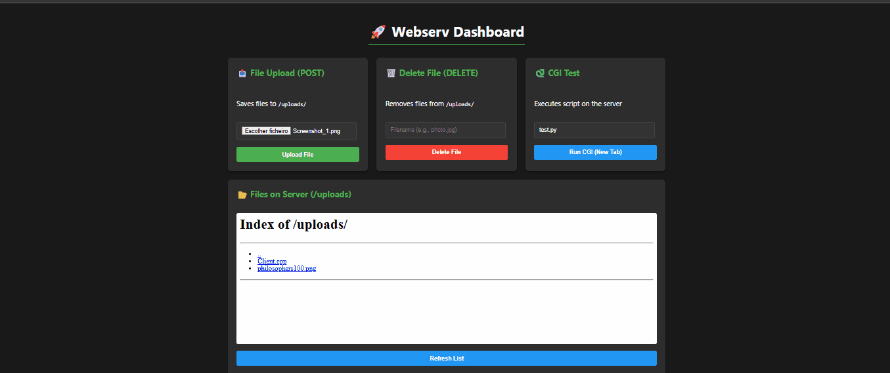
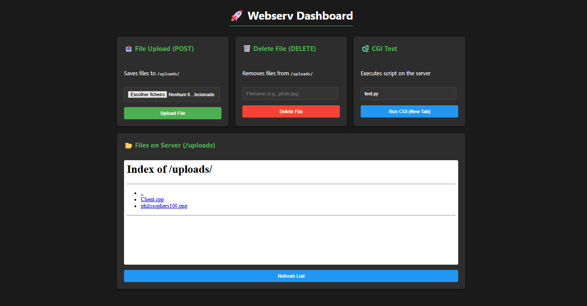

<i>This project has been created as part of the 42 curriculum by sdavi-al, brunogue, jhualves.</i>

# Webserv



## Description

Webserv is a custom HTTP/1.1 server written in C++98, developed as part of the 42 curriculum.

The goal of this project is to understand how a real web server works internally by implementing core features from scratch, without using external libraries.
The server handles multiple clients simultaneously using non-blocking I/O and select(), parses HTTP requests, and generates compliant HTTP responses.

## Main features:

- HTTP/1.1 support;
- GET, POST, DELETE methods;
- Static file serving;
- Multiple server blocks (virtual hosts);
- Custom configuration file (nginx-inspired syntax);
- CGI execution;
- File uploads;
- Custom error pages;
- Client body size limit;
- Directory listing (autoindex);

## Instructions
#### Requirements

- Unix-based system (Linux/macOS)

- c++ compiler (C++98)

#### How to run
```
make
./webserv default.conf
```

Then access in your browser:

http://localhost:8080

## Project Structure

- Configuration parser;
- Server & socket management;
- HTTP request parsing;
- HTTP response generation;
- CGI handler;

## Resources
#### References

- https://www.alimnaqvi.com/blog/webserv
- Linux man pages (socket, bind, listen, accept, select)
- nginx documentation
- AI

## AI Usage

<b>AI (ChatGPT and Gemini) was used for:</b>

- Clarifying HTTP protocol concepts;

- Understanding networking edge cases;

- Debugging specific issues;

- Improving documentation wording;



All implementation and architectural decisions were developed and validated manually.